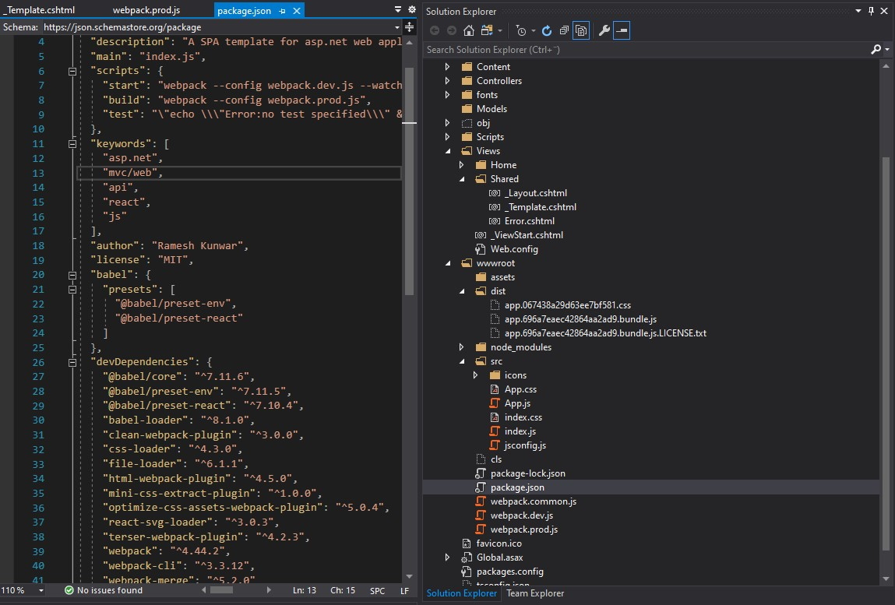
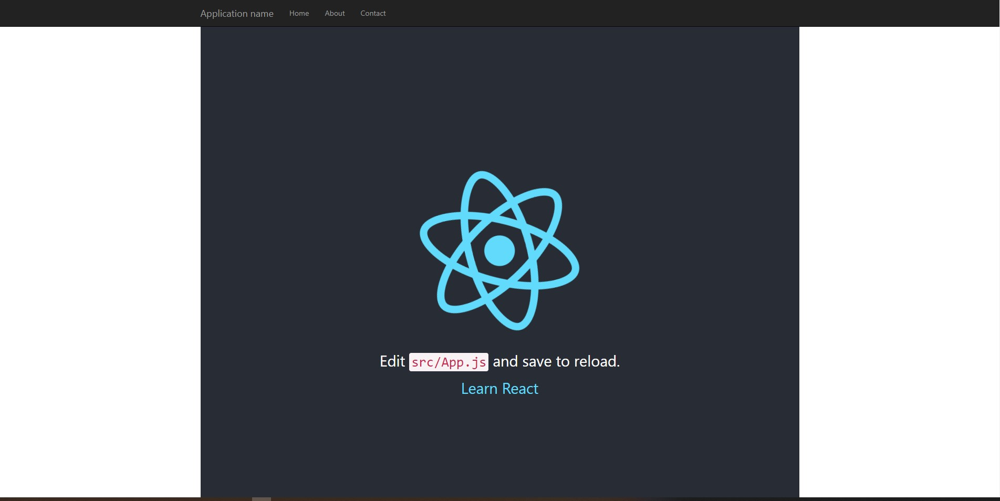

Substitute View of MVC or build front-end of Web API 2 with React JS. This template bundles, splits, minifies & injects scripts & styles on \_Layout.cshtml file dynamically at build time.

>>> ## The template has been updated with Webpack 5 & React 17. Read [here](https://kunwar.dk/posts/updated-asp-dot-net-mvc-react-15-webpack-5-template/)

Visual Studio 2019 comes with React JS template but only for .Net Core. For the .Net Framework-based projects, two of the many possible things can be done (consuming third-party API is not considered in this blog as it will be pure React app).

An ideal application would be the first choice; however, it has its constraints. Some of the constraints could be:

1. Authentication & authorization: If an organization already has in-house authentication & authorization (example, IdentityServer 3) then one needs to implement it separately. It adds the development time.
2. The complexity with deployment. A small organization might have constraints on numbers of the web servers available. A traditional .Net Framework web-app could be deployed as a single entity, whereas a separate back-end and a front-end add some extra challenges.

Above mentioned limitations give a reason to make a custom .Net Framework template for the web application.

The good news is, it's not difficult to create and use a custom React template which is not only well integrated with ASP.NET MVC/ Web API but also substitutes Razor with React JS. Moreover, bundling with Webpack leverage ES6+ to the project, which Visual Studio bundler (default bundler for .net framework web application) is unable to do.

Advantages of the template:

1. Inject automatically Reacts JS scripts & styles code dynamically to \_Layout.cshtml file.
2. Code splitting for smaller chunks with hashed file name. This helps to load only those files that has been changed. Options for lazy loading, better tree-shaking and other Webpack supported optimization.
3. Use attributes for authentication on the back-end controller as Index page (React root page) is served from the controller.

```
 [Auth(Roles = "role_for_this_service, another_role")]
 public class HomeController : Controller
```

4. Leverage full support of Webpack for bundling, minifying, splitting, which is not possible for .Net Framework web application.

> Confused with the jungle of .Net Framework, .Net Core, .Net 5 and .Net Standard? I'll be writing a blog for that. In this article, I will interchangeably be using .Net Framework and ASP.NET MVC/Web API for the web application that uses .Net Framework 4.x.x.

5. Attribute based authentication & authorization for Web API which is already available (in-house, example, we use IdentityServer3) or can be made using minimum effort.
6. Template using Typescript (template coming soon).

## Enough background! Let's create the template

> _TL;DR The template can be downloaded from the [Github](https://github.com/rameshkunwar/dotNetFramework4.x.x-ReactJS-template.git)_

This template is created using (and assumed they are already installed):

- Microsoft Visual Studio Community 2019(Version 16.7.5). However, should not be a problem with any versions.
- .Net Framework 4.7.2. Again, works from 4.6.1 onward. Change to lower version, if 4.7.2 is not installed on the computer.
- Latest version of Node.js installed

### Create folder for the React

1. Create an empty asp.net mvc or web api project. _Remember to select MVC_. Non essential files and folders will be removed later.
2. Create a folder on the root of the project, say **wwwroot.**. This is where React app resides.
3. Right-click this **wwwroot** folder and select _Open folder in file explorer_.
4. On folder explorer, click on the end of the address bar, this will select all text, if not selected, select all text on address bar.
5. Write **cmd** and hit enter key.
6. This will open a Terminal/Command prompt. It should be something like this, **wwwroot** should be the root.
   `D:\Workspace\AspNetFrameworkReactTemplate\wwwroot>`. This blog assumes React app root folder as _wwwroot_.

### Package.json

1. Package.json contains list of all installed packages as well as command for the development and production build.
2. `npm init` creates package.json file.
   > `npm init` creates an interactive session, which gives a chance to input various entries.
3. After creating package.json, it's time to add packages need to create the template.

### Webpack

`npm install --save-dev webpack` and webpack-cli for > v4.x.x `npm install --save-dev webpack-cli` installs latest version of Webpack as development dependency, i.e., files will not be bundled for production.

We need webpack config files for bundling related operations. We will create 3 files, one common (containing basic settings) and two for development and production respectively. It is also possible to create 4th for staging with little effort.

> "While we will separate the production and development specific bits out, note that we'll still maintain a "common" configuration to keep things DRY. In order to merge these configurations together, we'll use a utility called webpack-merge. With the "common" configuration in place, we won't have to duplicate code within the environment-specific configuration" - [webpack](https://webpack.js.org/guides/production/)

1. `npm install --save-dev webpack-merge`
2. Create 3 webpack config files, i.e., webpack.common.js, webpack.prod.js, webpack.dev.js inside _wwwroot_ .
3. Let's tell package.json about webpack config files by adding following, also add babel's present for react and babel itself:

```
  "scripts": {
    "start": "webpack --config webpack.dev.js --watch",
    "build": "webpack --config webpack.prod.js",
    },
      "babel": {
        "presets": [
            "@babel/preset-env",
            "@babel/preset-react"
         ]
    },
```

4. Let's install some useful packages for webpack. Install all of them using `npm install --save-dev PACKAGE-NAME-WRITTEN-BELOW`
   - @babel/core
   - @babel/preset-env
   - @babel/preset-react
   - babel-loader
   - clean-webpack-plugin
   - css-loader
   - html-webpack-plugin
   - mini-css-extract-plugin
   - optimize-css-assets-webpack-plugin
   - react-svg-loader
   - terser-webpack-plugin

## webpack.common.js

copy and paste the content of following three files in their respective file.

```
const path = require('path');
const { CleanWebpackPlugin } = require('clean-webpack-plugin');
const MiniCssExtractPlugin = require('mini-css-extract-plugin');
const HtmlWebpackPlugin = require('html-webpack-plugin');

//This will inject correct path of scripts in _Layout.cshtml via _Layout_Template.cshtml otherwise it will omit /research
const ASSET_PATH = process.env.ASSET_PATH || '/wwwroot/dist/';

module.exports = {
    entry: {
       app: './src/index.js',
    },
    plugins: [
        // new CleanWebpackPlugin(['dist/*']) for < v2 versions of CleanWebpackPlugin
        new CleanWebpackPlugin(),
        new HtmlWebpackPlugin({
            title: 'Production',
            filename: '../../Views/Shared/_Layout.cshtml',
            template: '../Views/Shared/_Template.cshtml',
            inject: false
        }),
    ],
    module: {
        rules: [
            {
                use: {
                    loader: "babel-loader"
                },
                test: /\.js$|jsx/,
                resolve: {
                    extensions: [".js", ".jsx"]
                },
                exclude: /node_modules/
            },
            {
                use: [MiniCssExtractPlugin.loader, 'css-loader'],
                test: /\.css$/
            },
            {
                test: /\.svg$/,
                exclude: path.resolve(__dirname, 'node_modules', 'font-awesome'),
                use: ['babel-loader', 'react-svg-loader'],
            },
        ]
    },
};
```

### webpack.dev.js

```
const path = require('path');
const { merge } = require('webpack-merge');
const MiniCssExtractPlugin = require('mini-css-extract-plugin');
const common = require('./webpack.common.js');

module.exports = merge(common, {
    mode: 'development',
    devtool: 'eval-source-map',
    devServer: {
        contentBase: './dist',
    },
    plugins: [
        new MiniCssExtractPlugin({
            filename: '[name].css',
            chunkFilename: '[id].css',
        }),
    ],
    watch: true,
    output: {
        filename: '[name].bundle.js',
        path: path.resolve(__dirname, 'dist'),
    },
});
```

### webpack.prod.js

```
const path = require('path');
const { merge } = require('webpack-merge');
const TerserJSPlugin = require('terser-webpack-plugin');
const MiniCssExtractPlugin = require('mini-css-extract-plugin');
const OptimizeCSSAssetsPlugin = require('optimize-css-assets-webpack-plugin');
const common = require('./webpack.common.js');

module.exports = merge(common, {
    mode: 'production',
    optimization: {
        minimizer: [new TerserJSPlugin({}), new OptimizeCSSAssetsPlugin({})],
    },
    plugins: [
        new MiniCssExtractPlugin({
            filename: '[name].[contenthash].css',
            chunkFilename: '[id].css',
        }),
    ],
    output: {
        filename: '[name].[contenthash].bundle.js',
        path: path.resolve(__dirname, 'dist'),
    },
});
```

> ### Why output on both prod and dev file, and why **contenthash** on prod file name?
>
> Web-browsers tend to cache scripts and styles. Having _contenthash_ allows hashed filename on build (if changes has been made). This forces browser to discard cached content and load from the server.

Now, our settings for the webpack is almost done (bundle splitting comes later). We need to prepare our \_Layout.cshtml file ready to be injected with the js and css file links by webpack on build time.

### Layout template file under Views -> Shared

1. Create a _\_Template.cshtml_ file under Views -> Shared.
2. Copy all contents of _\_Layout.cshtml_ to the _\_Template.cshtml_

If you look at the _webpack.common.js_, we have already told webpack file; where to looks for template and the destination file (\_Layout.cshtml) to be injected.

```
 new HtmlWebpackPlugin({
    title: 'Production',
    filename: '../../Views/Shared/_Layout.cshtml',
    template: '../Views/Shared/_Template.cshtml',
    inject: false
}),
```

## \_Template.cshtml

This file will be similar to the _\_Layout.cshtml_. The only difference will be code to inject script and styles.

#### Copy & paste following code on `<head></head>` section:

```
 <% for (var style in htmlWebpackPlugin.files.css) { %>
    <link rel="stylesheet" href="<%= htmlWebpackPlugin.files.css[style] %>" />
<% } %>
```

#### Copy & paste following code just before the `</body>` section (end of the body):

```
 <% for (var chunk in htmlWebpackPlugin.files.js) { %>
    <script src="<%= htmlWebpackPlugin.files.js[chunk] %>"></script>
<% } %>
```

> CAUTION: Remember to make any changes on \_Template.cshtml as \_Layout.cshtml file, now, onwards will be generated dynamically!

## Add React JS

Go the the [Github](https://github.com/rameshkunwar/dotNetFramework4.x.x-ReactJS-template.git) repo of this project. Copy _src_ folder and paste inside _wwwroot_ folder of the project.

### Install React and ReactDOM

`npm i react react-dom`

Now, we have install every dependencies to run our React project.

### Compile the scripts

Go the terminal/cmd and type (must be at the root of the project, in our case _wwwroot_ )
`npm run start`

It creates the development bundle of scripts and styles and inject them in to the _\_Layout.cshtml_ via _\_Template.cshtml_. You can confirm it by looking into the _/dist_ folder. The project structure looks like below:


If Script and Style links are injected in the _\_Layout.cshtml_, then the project is ready to run. Remember to add folders/files with React demo app (the demo app is copied from Create React App).

> Remember, we have not deleted files that comes with default ASP.NET MVC template. We gonna do that later on. It's not necessary to delete them if you need, however, they would increase the bundle size and we gonna remove _bundle.config_ too as we use Webpack.

Press F5 or click Start to run the project. This is necessary, as we are using IIS Express (shipped with Visual Studio) to act as our dev server.

If if runs without an error, we should be able to see a page similar to the below:


React app is running along with the ASP.NET MVC template's Bootstrap navbar! Isn't it a beautiful view!

> Now, we can go ahead and remove all _nuget_ packages that is not needed.

1. Right-click the project (NOT the solution) and select _Manage Nuget Packages_
2. Uninstall packages deemed not need for the project, probably, it would be _jQuery_ and _bootstrap_. If you need these 2 packages, install using npm.
3. Remove _bundle.config_ from /App*Start folder and entries of bundle from *\_Template.cshtml\_.

## Splitting bundle file

The template is ready. However, there is one more important thing (probably there are many ;-) ). When the project grows so the build size. Big bundle size could give problems such as,

- Single large chunk size (think of a bundle with all source code along with dependencies).
- If a small change is made, Webpack detects this and generates a new bundle file with a new hash key. Now, the browser has to reload the whole bundle!
- Can't pre-or-lazy load due to single bundle file.

### Let's alter the _webpack.common.js_ and _\_Template.cshtml_ for bundle splitting.

After running `npm run build or start`, we should be able to similar bundle files as shown below.

```

                        Asset             Size     Chunks                         Chunk Names
../../Views/Shared/_Layout.cshtml        1.49 KiB          [emitted]
app.067438a29d63ee7bf581.css             768 bytes     0  [emitted] [immutable]  app
app.542ea302f9487596bd9f.bundle.js       130 KiB       0  [emitted] [immutable]  app
runtime.e9d0f715e4067b817a45.bundle.js   1.46 KiB      1  [emitted] [immutable]  runtime
app.542ea302f9487596bd9f.bundle.js.LICENSE.txt 790 bytes [emitted]
```

> NOTE: I installed moment and react-router to increase the build size so that more chunks will be created, just for demonstration purpose, without success. However, I have tried this in my project and this works! I can assure you about that.

### Updated _webpack.common.js_

```
const path = require('path');
const { CleanWebpackPlugin } = require('clean-webpack-plugin');
const OptimizeCSSAssetsPlugin = require('optimize-css-assets-webpack-plugin');
const TerserJSPlugin = require('terser-webpack-plugin');
const MiniCssExtractPlugin = require('mini-css-extract-plugin');
const HtmlWebpackPlugin = require('html-webpack-plugin');

//Use this if your domain name has path. Example, www.example.com/myapp
//This will inject correct path of scripts in _Layout.cshtml via _Layout_Template.cshtml otherwise it will omit / research

//const ASSET_PATH = process.env.ASSET_PATH || '/myapp/wwwroot/dist/';

module.exports = {
    entry: {
       app: './src/index.js',
    },
    output: {
       // publicPath: ASSET_PATH,
        filename: '[name].[contenthash].bundle.js',
        path: path.resolve(__dirname, 'dist'),
    },
    plugins: [
        // new CleanWebpackPlugin(['dist/*']) for < v2 versions of CleanWebpackPlugin
        new CleanWebpackPlugin(),
        new HtmlWebpackPlugin({
            title: 'Production',
            filename: '../../Views/Shared/_Layout.cshtml',
            template: '../Views/Shared/_Template.cshtml',
            inject: false
        }),
    ],
    module: {
        rules: [
            {
                use: {
                    loader: "babel-loader"
                },
                test: /\.js$|jsx/,
                resolve: {
                    extensions: [".js", ".jsx"]
                },
                exclude: /node_modules/
            },
            {
                use: [MiniCssExtractPlugin.loader, 'css-loader'],
                test: /\.css$/
            },
            {
                test: /\.svg$/,
                exclude: path.resolve(__dirname, 'node_modules', 'font-awesome'),
                use: ['babel-loader', 'react-svg-loader'],
            },
        ]
    },
    optimization: {
        minimizer: [new TerserJSPlugin({}), new OptimizeCSSAssetsPlugin({})],
        moduleIds: "hashed",
        runtimeChunk: "single",
        splitChunks: {
            chunks: "all",
            maxInitialRequests: Infinity,
            minSize: 300000,
            cacheGroups: {
                vendor: {
                    test: /[\\/]node_modules[\\/]/,
                    name(module) {
                        // // get the name. E.g. node_modules/packageName/not/this/part.js
                        // //or node_modules/packageName
                        const packageName = module.context.match(
                            /[\\/]node_modules[\\/](.*?)([\\/]|$)/
                        )[1];
                        //  //npm package names are URL-safe, but some servers don't like @ symbols
                        return `react-dot-net-app.${packageName.replace("@", "")}`;
                    }
                }
            }
        }
    }
};
```

### Updated \_Template.cshtml

```
 <% for (var chunk in htmlWebpackPlugin.files.chunks) { %>
    <script src="<%= htmlWebpackPlugin.files.chunks[chunk].entry %>"></script>
<% } %>
```

### Bundle injection problem with address having path, example, https://example.com/myapp

We need to specify _publicpath_ in the webpack.common.js

```
....... code removed for brevity

const ASSET_PATH = process.env.ASSET_PATH || '/myapp/wwwroot/dist/';

module.exports = {
    entry: {
       app: './src/index.js',
    },
    output: {
        publicPath: ASSET_PATH,
        filename: '[name].[contenthash].bundle.js',
        path: path.resolve(__dirname, 'dist'),
    },

.......... code removed for brevity

```

#### That's all for JavaScript template. I will be soon writing another template with _TypeScript_. Tweet me or write an email if any questions, suggestions or better ideas. Thanks for reading.
