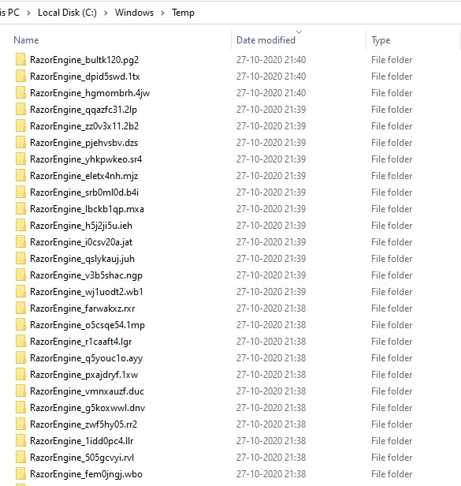

RazorEngine tries hard to delete the temporary files it creates, but it's not always possible, especially, if running from default `AppDomain`. The solution provided by [RazorEngine](https://github.com/Antaris/RazorEngine) works fine on console application (deletes temporary files while exiting from Main method), however, it won't work if the app is run as a service.

RazorEngine is a templating engine built on top of Microsoft's Razor parsing engine. It allows us to use Razor syntax to build dynamic templates, for example, we can generate a email body using using dynamic data for a console application.

Mailchimp and similar product are great tool to create and send mail, however, options to send dynamic content is very limited. A company might want to send weekly plans to their customers based upon customers' subscriptions. In simple word, not all customers will get same content! This is not a big challenge in a web-application, however, if we are going to send the content as an email then it's a challenge.

This is where RazorEngine shines. It provides us the same benefit of Razor we use in our ASP.NET MVC to generate Views using `cshtml` files. RazorEngine uses same `cshtml` files to generate templates.

> RazorEngine is itself a blog topic. Therefore, I am not going to talk in detail about it. I am only going to address one of the few challenges using RazorEngine.

However, many of us has observed that it's difficult to delete the temporary files created by RazorEngine. A simple solution provided by the author of RazorEngine works fine with console application. It let's use a proxy AppDomain and unload the proxy domain before exiting, thereby, cleaning all the temporary files.

```
static int Main(string[] args)
{
    if (AppDomain.CurrentDomain.IsDefaultAppDomain())
    {
        // RazorEngine cannot clean up from the default appdomain...
        Console.WriteLine("Switching to secound AppDomain, for RazorEngine...");
        AppDomainSetup adSetup = new AppDomainSetup();
        adSetup.ApplicationBase = AppDomain.CurrentDomain.SetupInformation.ApplicationBase;
        var current = AppDomain.CurrentDomain;
        // You only need to add strongnames when your appdomain is not a full trust environment.
        var strongNames = new StrongName[0];

        var domain = AppDomain.CreateDomain(
            "MyMainDomain", null,
            current.SetupInformation, new PermissionSet(PermissionState.Unrestricted),
            strongNames);
        var exitCode = domain.ExecuteAssembly(Assembly.GetExecutingAssembly().Location);
        // RazorEngine will cleanup.
        AppDomain.Unload(domain);
        return exitCode;
    }
    // Continue with your code.
}
```

Without above code, we will encounter a familiar warning from the RazorEngine in the console.

```
RazorEngine: We can't cleanup temp files if you use RazorEngine on the default Appdomain.
Create a new Appdomain and use RazorEngine from there.
...text removed for brevity....
Please clean 'c:\Users\username\AppData\Local\Temp\RazorEngine_5me4r4xf.1on' manually!
```

The above warning gives us a hint regarding possible solution. One of the solution is mentioned above. However, we need to find another solution if we are going to use RazorEngine as a Windows service. The solution still would be to use a proxy domain to parse the email and unloading when it is done.

We can use `MarshalByRefObject`. It is the base class for objects that are marshalled by reference across _Appdomain_ boundaries[^1]. In simple word, it supports to access objects between two Appdomains.

## Create a class to inherits `MarshalByRefObject`

```
public class MarshalByRefTypeInService:MarshalByRefObject
{
    public string CreateMailBodyInSeparateAppDomain()
    {
        return ParseEmail.MakeEmailBody();
    }
}
```

## Create another Appdomain and access the method

```
AppDomainSetup domainSetup = new AppDomainSetup();
var executeAssembly = Assembly.GetExecutingAssembly().FullName;
domainSetup.ApplicationBase = AppDomain.CurrentDomain.BaseDirectory;
domainSetup.ConfigurationFile = AppDomain.CurrentDomain.SetupInformation.ConfigurationFile;

string proxyAppDomainName = $"RazorEngineProxyDomain-{Guid.NewGuid()}";
//Create wrapper AppDomain
AppDomain wrapperAppDomain = AppDomain.CreateDomain(proxyAppDomainName, null, domainSetup);

//MarshbyRefType proxy
MarshalByRefTypeInService byRefType = (MarshalByRefTypeInService)wrapperAppDomain.CreateInstanceAndUnwrap(executeAssembly, typeof(MarshalByRefTypeInService).FullName);

var body = byRefType.CreateMailBodyInSeparateAppDomain();
AppDomain.Unload(wrapperAppDomain);
```

> Remember to Serialize the objects if, objects need to be passed as parameter while accessing the remote method as we are working, now, across different domains.

**Source code can be found [here](https://github.com/rameshkunwar/RazorEngineCleanTempFiles.git)**

[^1]: https://www.oreilly.com/library/view/c-in-a/0596001819/re116.html
