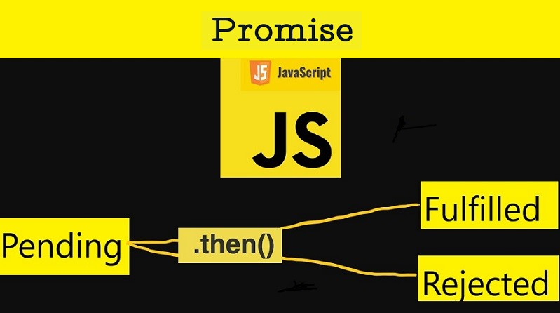
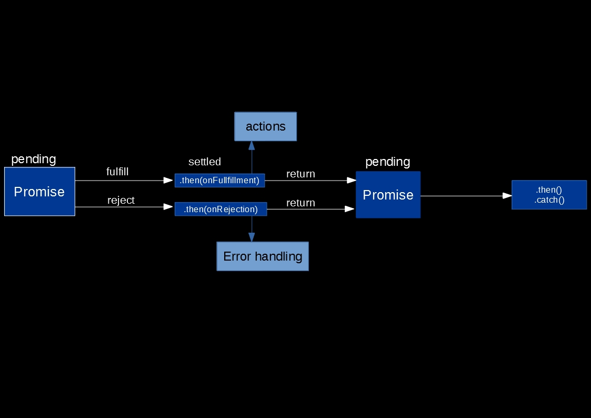

A promise is an object that represents the completion (or failure in worst case) of an asynchronous operation and the operation value.

### Promise in layman's terms

Let say, you applied for a loan. The bank gonna take some time (pending request) before giving their decision. The decision could be accepted (fulfilled) or rejected. JavaScript [Promise](https://developer.mozilla.org/en-US/docs/Web/JavaScript/Reference/Global_Objects/Promise) works on similar principle.

We might have already used Promise if we have used [Fetch API](https://developer.mozilla.org/en-US/docs/Web/API/Fetch_API). It returns a Promise.

### Why Promise?

It aims to resolve the problem with nested callbacks for asynchronous operation, often called as _callback-hell._

A hypothetical example of a callback-hell.

```
getUserId( function(error, data) {
  if(error){
    handleError(error);
  }else{
    getUserCollections(data.userUUID, function(error, data) {
      if(error){
        handleError(error);
      } else{
        setLogInfo(function(error, data) {
          if(error){
            handleError(error);
          }else{
            //some operation
          }
        });
      }
    });
  }
});
```

### How Promise solves this callback-hell problem?


