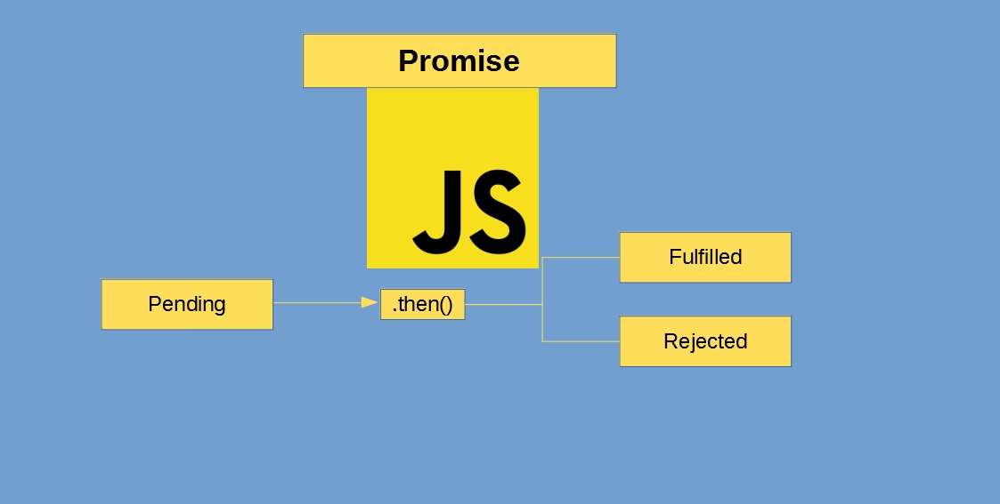

A promise is an object that represents the completion (or failure in worst case) of an asynchronous operation and the operation value.

### Promise in layman's terms

Let say, you applied for a loan. The bank gonna take some time (pending request) before giving their decision. The decision could be accepted (fulfilled) or rejected. JavaScript [Promise](https://developer.mozilla.org/en-US/docs/Web/JavaScript/Reference/Global_Objects/Promise) works on similar principle.

We might have already used Promise if we have used [Fetch API](https://developer.mozilla.org/en-US/docs/Web/API/Fetch_API). It returns a Promise.

### Why Promise?

It aims to resolve the problem with nested callbacks for asynchronous operation, often called as _callback-hell._

A hypothetical example of a callback-hell.

```
getUserId( function(error, data) {
  if(error){
    handleError(error);
  }else{
    getUserCollections(data.userUUID, function(error, data) {
      if(error){
        handleError(error);
      } else{
        setLogInfo(function(error, data) {
          if(error){
            handleError(error);
          }else{
            //some operation
          }
        });
      }
    });
  }
});
```

### How Promise solves this callback-hell problem?

Promise do uses callback; however, a callback is attached rather than passed. Callbacks, in Promise, are chained as shown in the figure below.


The above callback code can be re-written using Promise as (note: it's a hypothetical situation and with the assumption that the methods return Promise).

```
getUserId()
    .then(function(data) {
        return getUserCollections(data.userUUID)
    }).then(function(data) {
        return setLogInfo(data)
    }).then(function(finalResponse) {
        //code for some operation
    }).catch(handleErrorCallback);
```

Well, it is also possible to pass multiple promises as an input, and returns a single Promise that resolves to an array of the results of the input promises[^1].

```
const loggedUserId = getUserId();
const userCollections = getUserCollections();
const userRights = getUserRights();

Promise.all([loggedUserId, userCollections, userRights]).then((values) => {
  //resolves to an array of the results
  //output will be [uuid, array_of_objects, array]
});
```

### How to create a Promise?

Most of the time we consume Promise. For example, Fetch(). Let's create a simple Promise.

```
let promise = new Promise(function(resolve, reject) {
  // code that does some magic! for example, get data from API, upload files, etc
});
```

Let's examine the above code and identify bits and pieces of a Promise.

- Promise(): Constructor of a Promise
- resolve, reject: Callbacks of the function passed to the Promise.
  - resolve: Returned if finished successfully
  - reject: If an error occurred.

Let's try to create a better example that simulates a real-life situation. An API might return an error message. In the example below, we simulate similar error message from an API end-point. It is resolved even though it returns error as the Promise was not rejected in anyway. For a reason, we are receiving error from our API end-point.

```
 function domSomethingAsync() {
        return new Promise((resolve, reject) => {
          setTimeout(() => {
            resolve({
              IsError: true,
              ErrorMessage:
                "Simulating an error being returned from API"
            });
          }, 0);
        });
      }
```

### How do we consume Promise?

The above is the function, that returns a Promise. We always chain a Promise using either _.then()_ or _.catch()_ or _.finally()_
The proper syntax for doing it is:
`promise.then(//code here).catch(//code here).finally(//code here)`
**NB:** _finally()_ is very similar to try-catch-finally. Finally always runs regardless a Promise is resolved or rejected.

Let's try to consume the above function that returns promise.

```
const handleSomething = () => {
  domSomethingAsync()
    .then(res => {
      document.getElementById(
        "app"
      ).innerHTML = ` <h1>Resolved</h1><br/> <h2> ${
        res.IsError
      } </h2> <br/> <h2> ${res.ErrorMessage} </h2>`;
    })
    .catch(error => {
      document.getElementById(
        "app"
      ).innerHTML = `<h1>Rejected</h1><br/>  <h2> ${
        error.IsError
      } </h2> <br/> <h2> ${error.ErrorMessage} </h2>`;
    });
};
```

[Codesandbox link](https://bit.ly/32pzQ0M) of the above code.

> jQuery do support [Promise](https://api.jquery.com/promise/). Promise is not just a Vanilla JS thing. It is possible to chain jQuery Ajax call. It's handy, especially, if second Ajax call is dependent of the first or should run after first is completed. Example, `$.when(firstAjaxCallFunction).then(doSecond).then(doThird)`

### Good links to learn promise

1. MDN (Mozilla Developer Network) is always good place to looks for JavaScript documentations. [Promise](https://developer.mozilla.org/en-US/docs/Web/JavaScript/Reference/Global_Objects/Promise) documentation and all methods can be found following the link.
2. [javascript.info](https://javascript.info/promise-basics) has detailed explanation.

[^1]: https://developer.mozilla.org/en-US/docs/Web/JavaScript/Reference/Global_Objects/Promise/all
