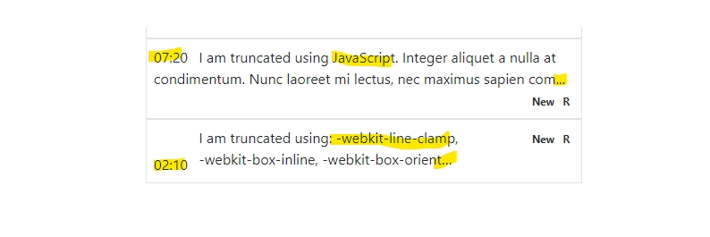

Truncating multiple line text using pure CSS can be done, however, it's has some caveats. There a JavaScript solution might be ideal in some cases.

### Truncating single line text followed by ellipsis

The is very common and widely used scenario and it has a standard CSS implementation.

```
.truncate {
  width: 20px;
  white-space: nowrap;
  overflow: hidden;
  text-overflow: ellipsis;
}
```

The above code results in `A quick brown fox jumps...`

So far so good. What about if we want to limit our text to 2 lines? Well, we have few possible solutions:

- Pure CSS
- JavaScript

### CSS way: -webkit-line-clamp way

According to [MDN](https://developer.mozilla.org/en-US/docs/Web/CSS/-webkit-line-clamp), `-webkit-line-clamp` allows limiting of the content of a _block container_ to the specified number of lines. However, it needs some friends to work as one to produce the result.

```
overflow: hidden;
display: -webkit-box; or -webkit-inline-box
-webkit-line-clamp: 2;
-webkit-box-orient: vertical;
```

The above code will truncate or clip the text to two line and show truncated text with ellipsis. Despite being a **Working Draft**, the code works in all modern browsers except the Internet Explorer.

However, it might not be a perfect solution in certain situations. The biggest problem is _-webkit-box_ or _-webkit-inline-box_. Despite having inline, it always behaves as a block.

It is very difficult to find information about _-webkit-box_! [MDN](https://developer.mozilla.org/en-US/docs/Web/CSS/box-flex) provides some information under _Formal definition_. The important thing is it's a _non-standard_ feature but surprisingly all browsers support it!

### The problem

_-webkit-line-clamp_ does truncate text for the given line. However, for it to work, it's dependent on three of the four properties, i.e., (display:-webkit-box or -webkit-inline-box), -webkit-line-clamp, and -webkit-box-orient. These 3 properties are its strength as well as Achilles' heel.

### _-webkit-box or -webkit-inline-box_

_-webkit-box or -webkit-inline-box_ behaves like block and gives a big problem when used with other inlined elements. For example, if the text to be truncated has to be inlined with other elements. It won't inline, even with -webkit-inline-box!

Let's examine a code shown below. I wanted to show all elements as inline, the last element inlined and aligned-right. I wanted to show like:

```
<div class="d-flex p-2 justify-content-between border4">
  <div class="d-inline w-100 cursor-pointer">
    <p class="d-inline text-dark-500 m-0 mr-2">02:10</p>
    <p class="m-0 pr-2 webkit-line-clamp">
      Etiam pharetra semper commodo. Integer feugiat tellus nibh, sit
      amet pretium leo porta eu. Integer aliquet a nulla at
      condimentum. Nunc laoreet mi lectus, nec maximus sapien commodo
      sit amet. Nunc a mi non nulla dapibus tristique. Donec vel
      suscipit ante. Aenean euismod sem eu fermentum gravida.
    </p>
    <div class="d-inline" style="float: right">
        <span class="badge badge-ny pl-0 font-weight-500">
          <span>New</span>
        </span>
        <span class="badge badge-r font-weight-700 pl-0">
            <span> R </span>
          </span>
    </div>
  </div>
</div>
```

> Complete code for this blog can be found here.

It does truncate text, but broke my design, which I did not want.


The first item (in the screen shot shown above) is what I wanted. The third line text (New, R) is also inline but aligned right. I would have loved to get the same result by using -webkit-line-clamp (as it's very simple and clean), however, it did not meet my purpose. I had to look elsewhere for the rescue.

### JavaScript (once again, the savior!)

JavaScript implementation is tricky with some pre-defined parameters. Such as:

- Amount of letters or words to show and truncate rest:
- Use _height_ of the div as the measurement index!

The first approach is shown [here](https://gomakethings.com/how-to-truncate-text-with-vanilla-javascript/). In my opinion, it's very difficult to know in advance how many words or characters will fill-up the given area. Therefore, I have dropped this idea.

### Using height of the _div_

Yes! A div with content has a height. Most of the time, we have consistent height among items. In my case, I had to show many items using the same layout. That made by task a lot easier.

I found that the height of the div for which text has to be truncated was '24px', when shown single line. For the 2 lines text, it was 48px. Now, if the height of div is greater than 48px, that means, the text of this div has to be truncated( **I wanted to show only 2 lines of text**).
