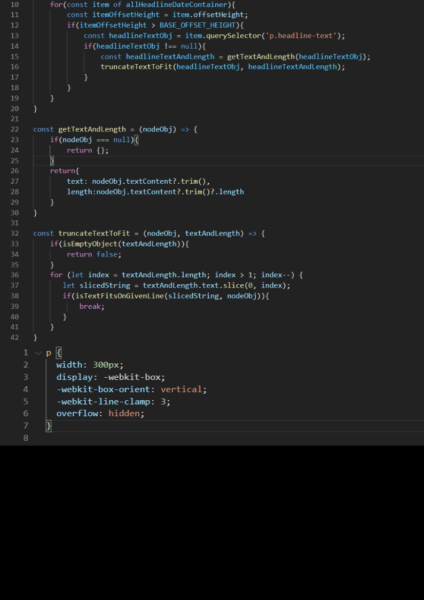

Truncating multiple line text using pure CSS can be done, however, it's has some caveats. There a JavaScript solution might be ideal in some cases.

### Truncating single line text followed by ellipsis

The is very common and widely used scenario and it has a standard CSS implementation.

```
.truncate {
  width: 20px;
  white-space: nowrap;
  overflow: hidden;
  text-overflow: ellipsis;
}
```

The above code results in `A quick brown fox jumps...`

So far so good. What about if we want to limit our text to 2 lines? Well, we have few possible solutions:

- Pure CSS
- JavaScript

### CSS way: -webkit-line-clamp way

According to [MDN](https://developer.mozilla.org/en-US/docs/Web/CSS/-webkit-line-clamp), `-webkit-line-clamp` allows limiting of the content of a _block container_ to the specified number of lines. However, it needs some friends to work as one to produce the result.

```
overflow: hidden;
display: -webkit-box; or -webkit-inline-box
-webkit-line-clamp: 2;
-webkit-box-orient: vertical;
```

The above code will truncate or clip the text to two line and show truncated text with ellipsis. Despite being a **Working Draft**, the code works in all modern browsers except the Internet Explorer.

However, it might not be a perfect solution in certain situations. The biggest problem is _-webkit-box_ or _-webkit-inline-box_. Despite having inline, it always behaves as a block.

It is very difficult to find information about _-webkit-box_! [MDN](https://developer.mozilla.org/en-US/docs/Web/CSS/box-flex) provides some information under _Formal definition_. The important thing is it's a _non-standard_ feature but surprisingly all browsers support it!

### The problem
