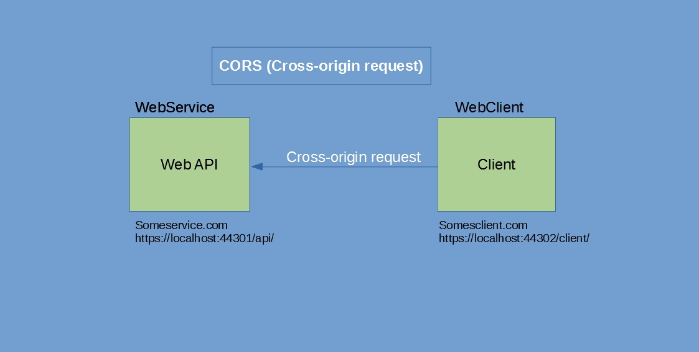

Sometimes it is necessary to overcome browser restrictions(making AJAX requests to another domain). CORS (Cross Origin Resource Sharing) allows us to relax the same-origin policy.

> The name AJAX is used also for XMLHttpRequest in this blog as AJAX uses XMLHttpRequest. **This blog is applicable only for web api 2 applications based on .Net Framework 4.x**

It is a good thing that browser prevents a web page from making AJAX request to another domain. However, sometimes, we need to relax this policy to test some apps on localhost or if the app is an API endpoint and is being consumed by cross-domain apps.

I encountered this _same-origin policy_ when I was testing two related apps on localhost. Because the two apps running of localhost had a different port number, they are considered as _cross-domain_ by the browser, hence, they prevent AJAX request. It was very frustrating as I was unable to make an AJAX call to another app running on localhost.

This restriction can be overcome using any of the two approaches:

1. CORS (Cross Origin Resource Sharing)
2. JSONP

According to [MDN](https://developer.mozilla.org/en-US/docs/Web/HTTP/CORS), CORS allows AJAX request to be made by a cross-origin app. It is an HTTP-header based mechanism to indicate any other origins.

## How to enable it?

The good thing is that _asp.net web API 2.x_ applications can use a _Nuget_ package to enable CORS.

It can be installed either by using 'Manage Nuget Packages' option or just by typing following command on Package-Manager

```
Install-Package Microsoft.AspNet.WebApi.Cors
```

### Configuration in **WebApiConfig.cs**

We need to tell App_Start/WebApiConfig.cs to enable CORS by

```
 public static void Register(HttpConfiguration config)
        {
            config.EnableCors();

            config.Routes.MapHttpRoute(
                name: "DefaultApi",
                routeTemplate: "api/{controller}/{id}",
                defaults: new { id = RouteParameter.Optional }
            );
        }
```

### Configuration in Controller

Now, we need to configure controller to accept cross-origin request by using _EnableCors_ attribute.

```
using System.Web.Http.Cors;

namespace MyWebAPI.Controllers
{
    [EnableCors(origins: "https://localhost:44301/client1", headers: "*", methods: "*")]
    public class MyApiController : ApiController
    {
        // Controller methods removed for brevity...
    }
}
```

> Remember NOT to use _Forward slash (/)_ at the end of origin url. F.ex, _https://localhost:44301/client1/_

### Allow multiple origins

```
[EnableCors(origins: "https://localhost:44301/client1, https://localhost:44301/client2", headers: "*", methods: "*")]
```

### Allow all origins (Probably not a good idea)

```
[EnableCors(origins: "*", headers: "*", methods: "*")]
```

### Allow globally (for all Web API Controllers). Make change in _App_Start/WebApiConfig.cs_

```
public static void Register(HttpConfiguration config)
    {
        var cors = new EnableCorsAttribute("https://localhost:44301/client", "*", "*");
        config.EnableCors(cors);
        // other code removed for brevity...
    }
```

### Allow HTTP methods explicitly. Here we only enable for _GET_

```
using System.Web.Http.Cors;

namespace MyWebAPI.Controllers
{
    [EnableCors(origins: "https://localhost:44301/client1", headers: "*", methods: "get")]
    public class MyApiController : ApiController
    {
        // Controller methods removed for brevity...
    }
}
```
