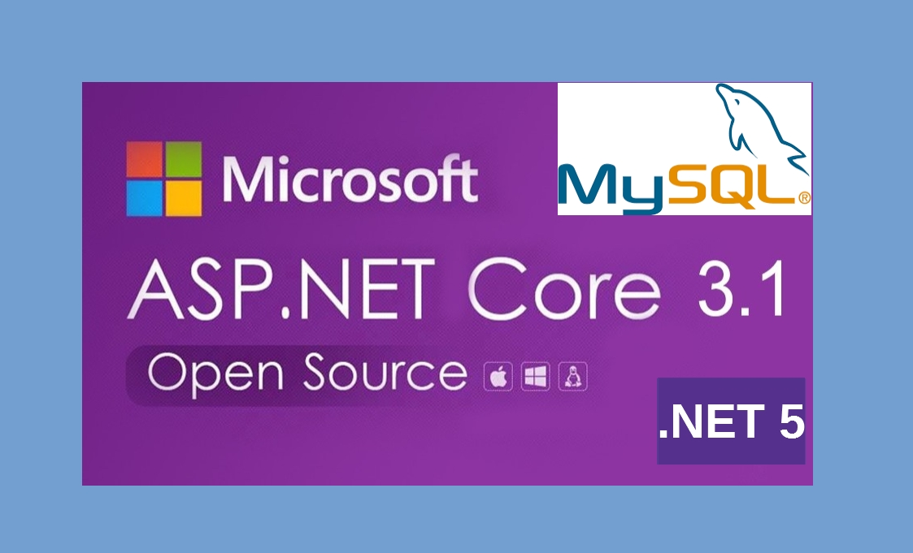
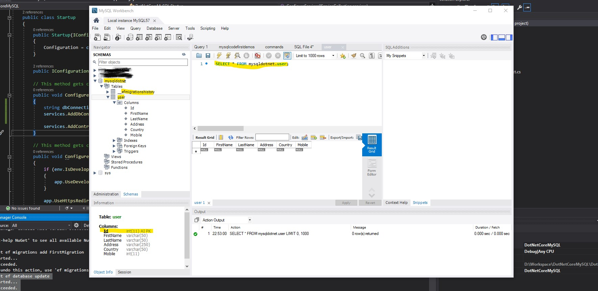

Possibility of using MySQL (or MariaDB) with .Net Core opens an opportunity to use open-source & free database. Moreover, one can take advantage of .Net Core or .Net 5 being cross-platform by bypassing all Microsoft's paid services! Yes, Linux hosting with one of the open-source & free database.

> MySQL is technically an open-source database. However, under Oracle, MySQL now has proprietary, closed-source modules. MariaDB, being a MySQL fork, is a good alternative. MariaDB 5.5 offers all of the MySQL 5.5 features[^1].

In this post, I will show how we can use _Entity Framework 5.0 Code First_ approach to create tables in a MySQL database.

## Project setup

The advantage of using .Net Core again is use of light-weight Visual Studio Code (perhaps one of the best open-source free code editor) with millions of plugins. Great for Linux as Visual Studio is available only for Windows and Mac. I will be using Visual Studio 2019 Community Edition (free) and MySQL 5.7.

We will be using **dotnet new** command to scaffold builtin template. It can also be done using GUI in Visual Studio.

1. Create a folder for the project.
2. Open command prompt, and go to the folder.
3. Type `dotnet new --list` . It shows a list of available templates.
4. We will be using _ASP.NET CORE Web API_ template targeting .Net Core 3.1.
5. Type `D:\DotNetCoreMySQL>dotnet new webapi --framework netcoreapp3.1`. Check [here](https://docs.microsoft.com/en-us/dotnet/core/tools/dotnet-new#template-options) for more template version.
6. The command will create a project in the given folder. Remember, it does NOT create a Solution like Visual Studio does. One need to run a command explicitly to create solution. I will be skipping it.

> This post assumes all the dependencies are installed. .NET Core SDK or Runtime (at least 3.1) (can check installed version using `dotnet --version`), MySQL and Visual Studio or Visual Studio Code (prepare to write more code).

Go to the project folder, right-click PROJECT_NAME.csproj file, and choose 'Open With Visual Studio'

## Install Entity Framework Core 5.0

Again, we can install package from Nuget using Visual Studio GUI. However, it's handy to do using CLI in Package Manager Console.

_Tips: Open nuget.org so that we can copy CLI from there_

1. Go to nuget.org and search EF Core or follow this [link](https://www.nuget.org/packages/Microsoft.EntityFrameworkCore/)
2. Click Package Manager tab, and click _copy_ icon on right-hand side.
3. Pase it in Visual Studio's Package Manager Console.
4. Install EntityFrameworkCore Design from [here](https://www.nuget.org/packages/Microsoft.EntityFrameworkCore.Design/)
5. We also need EF Core Command Line Tools to create migrations, update the database, etc. It's installed on global scope. First check if it's installed by `dotnet ef`. If you don't see text EF with Unicorn followed by options then we need to [install](https://www.nuget.org/packages/dotnet-ef/) it on **command prompt** by `dotnet tool install --global dotnet-ef --version 5.0.1`

## Install Entity Framework Core provider for MySQL

We will be using [Pomelo](https://github.com/PomeloFoundation/Pomelo.EntityFrameworkCore.MySql) provider over [MySql.Data.EntityFrameworkCore](https://www.nuget.org/packages/MySql.Data.EntityFrameworkCore). The latter one is official MySQL provider, however, I did not have a good experience with it, so my choice is Pomelo.

1. Get the latest (alpha.2) version from [here](https://www.nuget.org/packages/Pomelo.EntityFrameworkCore.MySql/5.0.0-alpha.2)
2. Paste the copied code to Package Manager Console.

## Create a database in MySQL (I use MySQL Workbench)

I am not going to show guidelines regarding creating a database and a user in MySQL. MySQL Workbench cannot be compared with SQL Server Management Studio but quite easy to use.

1. I am using a database **mysqldotnet** and a user **mysqldotnetuser** for this database in this example.

[^1]: https://mariadb.com/kb/en/changes-improvements-in-mariadb-55/

## Create a model to generate a table.

1. Create a folder Models at the root of the project.
2. Add a class to the folder, let say _User_
3. Now, let's define our model.

> By default, EF Core will pluralize the generated table name. For example, User will be mapped as Users in the database. To have singularize name, decorate class with the attribute ` [Table("User")]`

```
    [Table("User")]
    public class User
    {
        [Key]
        [DatabaseGenerated(DatabaseGeneratedOption.Identity)]
        public int Id { get; set; }

        [Required]
        [MaxLength(50)]
        public string FirstName { get; set; }

        [Required]
        [MaxLength(50)]
        public string LastName { get; set; }

        [Required]
        [MaxLength(250)]
        public string Address { get; set; }

        [Required]
        [MaxLength(50)]
        public string Country { get; set; }

        [MaxLength(15)]
        public int Mobile { get; set; }
    }
```

## Create DBContext

Now, DBContext (database context class) is the main class that coordinates Entity Framework functionality for a given data model. In other words, DBContext looks the models and generates corresponding database tables.

It's good idea to have database related operations in a separate project. But for the sake of simplicity, I am doing on the same project. This approach is not recommended.

1. Create a folder at the root of the project, let's say _Data_.
2. Create a _DbContext_ derived class inside the newly created folder, let's say _DotNetCoreMySQLContext_
3. Specify the entities to be included in the data model by creating _DbSet_ property like `public DbSet<User> Users { get; set; }`.

The _DbContext_ derived _DotNetCoreMySQLContext_ looks like this:

```
public class DotNetCoreMySQLContext : DbContext
{
    public DotNetCoreMySQLContext(DbContextOptions<DotNetCoreMySQLContext> options) : base(options) {}
    public DbSet<User> User { get; set; }
}
```

## Add connection string

1. We need to tell our app where to find our database.
2. Unlike _.net framework_, connection strings are specified in _appsettings.json_. There is no _web.config_.
3. Then we have to reference the connection string from _Startup.cs_.

_appsettings.json_

```
"AllowedHosts": "*",
  "ConnectionStrings": {
    "DotNetCoreMySQLAppConnection": "server=localhost; port=3306; database=mysqldotnet; user=mysqldotnetuser; password=Pa55w0rd!; Persist Security Info=false; Connect Timeout=300"
  }
```

> It's always a bad idea to store password in appsettings.json file. Even if we are pushing in our private repository. This can be avoided by using _user secrets_. Again, for the sake of simplicity, I am using plain password. However, _user secrets_ is a good topic for a blog itself!

## Inject connection string in _Startup.cs_

ConfigureServices method from _startup.cs_

```
 public void ConfigureServices(IServiceCollection services)
{
    string dbConnectionString = Configuration.GetConnectionString("DotNetCoreMySQLAppConnection");
    services.AddDbContext<DotNetCoreMySQLContext>(opt => opt.UseMySql(dbConnectionString, ServerVersion.AutoDetect(dbConnectionString)));

    services.AddControllers();
}
```

This line `services.AddDbContext<DotNetCoreMySQLContext>(opt => opt.UseMySql(dbConnectionString, ServerVersion.AutoDetect(dbConnectionString)))` tells the app to use _MySQL_ provider and our context class with the connection string from _appsettings.json_.

## Create migration and update database

Now, we have setup everything to use Code-First approach to create tables in the database. Entity Framework keep tracks of all models through migrations. Every time, we update or create model, we need to do so my making a unique migration. These migrations becomes a sort of record and they can be used to roll-back in the event of an error.

1. Create first migration by typing following command in _Package Manager Console_

```
PM> dotnet ef migrations add FirstMigration
Build started...
Build succeeded.
Done. To undo this action, use 'ef migrations remove'
PM>
```

EF creates a folder called _Migrations_ at the root of the project to store all migrations. 2. Apply changes to the database by typing command given below. Remember, MySQL server must be running at this time.

```
PM> dotnet ef database update
Build started...
Build succeeded.
Done.
```

## Confirm table creation in the database.

Open MySQL Workbench (or your SQL editor) and confirm the creation of the table.



## Using .NET 5.0

Change the Target Framework by right-clicking on the Project name. On _Application_ tab choose _.Net 5.0_ from the _Target Framework_ dropdown. The can also be done by opening _PROJECT_NAME.csproj_ file in text editor and changing
` <TargetFramework>net5.0</TargetFramework>`. NOTE: .NET 5 SDK or runtime must be installed.

## Testing if it works with .NET 5.0

1. Add a new model in the folder _Models_.
2. Add a new migration. `dotnet ef migrations add NewModel`
3. Update database `dotnet ef database udpate`

Refresh the database in MySQL to confirm the new table is created.

## _Source code for the blog can be found [here](https://github.com/rameshkunwar/DotNetCore31And50WithMySQL)_
