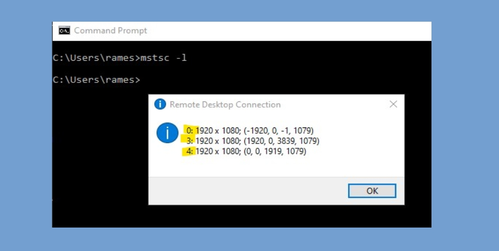

Due to COVID-19 crisis, most of the developers are working from home. It's obvious to have multiple monitors. However, there are also many who uses RDP (Remote Desktop Protocol) to connect to their office computer and work. This poses certain discomfort, which I had felt too.

We rely on technologies like Skype, Teams or Zoom to communicate with our fellow colleagues. It is obvious, we would like to use the camera too. I was using all of my screens for RDP and I had to minimize my RDP window every time I was communicating with my colleagues. Furthermore, I was not able to share my screen and show things. This was very irritating.

## The problem

The Windows Remote Desktop Connection allows only option to share all available monitors for the remote session. One cannot selectively choose. I connect through my laptop and has two monitors. I would only like to use my two monitors for the remote session and would like to use my laptop screen for Teams or Skype. With the current Remote Desktop Connection, it is not possible, at least straightforward.

## The Solution

However, there is a work-around which let's use choose monitors/screens selectively.

## Find active monitors

1. Type `C:\Users\rames>mstsc -l`
2. This shows a prompt with monitor order (for RDP session) and resolution. This is very important message.
3. Based on this information we need to determine the monitors id.
4. In the image below, the first one, i.e. `0: 1920 x 1080; (-1920, 0, -1, 1079)` is my laptop screen (which I don't want to share with remote session) and the last two are my monitors.
5. On Remote Desktop Connection GUI, `Use all my monitors for the remote session` under _Display_ must be chosen.

> There is no straight forward way to determine the monitors identity. You might need to turn-off a monitor and run `mstsc -l` to determine it's actual id.



## Edit \*.rdp file

1. Find the _rdp_ file. By default, it's saved as _Default.rdp_ in _Documents_ or _Desktop_ folder. Remember, it's a hidden file. Go to _View_ tab and check _Hidden items_ to see hidden files and folders.
2. Open the _rdp_ file in a text-editor.
3. This file contains all the settings of the current RDP session, therefore, it's a good idea to take a back-up of it.

### Example (excerpt) of the _Default.rdp_ file

```
full address:s:xyz-j-001
audiomode:i:0
redirectprinters:i:1
redirectcomports:i:0
```

4. Add this line in the _rdp_ file `selectedmonitors:s:3,4`. _3,4_ is the Id of the monitors that I want to include for the remote session.
5. Save it and _Connect_ to the remote computer. Now, only the mentioned monitors will be used for remote session.
