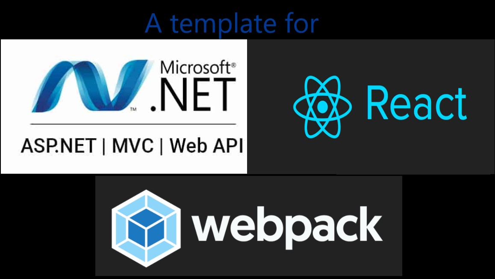

Updated: Template for ASP.NET MVC (.Net Framework 4.x.x) with React 17 & Webpack 5.

## This is the follow-up post of this [blog]("https://kunwar.dk/posts/asp-dot-net-mvc-react-js-template/")

### What's new in this template?

1. Removed all non-necessary Views (only has Index.cshtml & views under Shared).
2. Removed Scripts folder.
3. Updated webpack.common.js.
4. React JS 17.
5. Webpack 5.
6. BundleConfig.cs - all bundles entry removed.
7. jQuery, Bootstrap, etc Nugets removed. React Bootstrap (Bootstrap 4.6) can be downloaded from [here](https://react-bootstrap.github.io/) using npm.
8. Visual Studio / TFS (Team Foundation Server) specific: I personally prefer using Visual Studio Code for React JS development. However, Visual Studio might be needed to check-in solution, if using older version of TFS. If we use Visual Studio Code, then every time we build, we get output files under ** \dist ** folder. Visual Studio will not add any files created by other programs automatically. We have to manually add it. The easiest solution would be not to include files under **\dist** folder as they can always be generated. However, we need these files when we deploy. This project template has already implemented it so that TFS will ignore the files but will be included when deploying.

```
  </Content>
    <Content Visible="false" Include="wwwroot\dist\**">
    </Content>
```

Read my answer about it in [Stack Overflow](https://stackoverflow.com/questions/57825600/automatic-include-files-in-folder-in-visual-studio-2019-project/59676355#59676355)

Template can be downloaded from [Github](https://github.com/rameshkunwar/AspDotNetMvcReact17Webpack5Template)

> My old [post](https://kunwar.dk/posts/asp-dot-net-mvc-react-js-template/) describes in detail how I made this template.

### Related posts

1. [ASP.NET MVC (.Net Framework) with React 17 with Typescript and Webpack 5](https://kunwar.dk/posts/asp-dot-net-mvc-react-js-typescript-webpack-template/)
2. [ASP.NET MVC (.Net Framework) with React 16 and Webpack 4](https://kunwar.dk/posts/asp-dot-net-mvc-react-js-template/)
