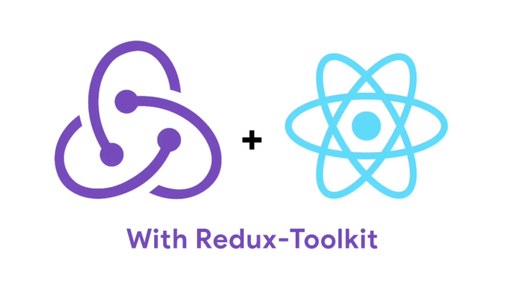

Redux is a popular state management tool for React. Now, implementing Redux has become even easier and simple with the release of Redux-Toolkit.

Previously, Redux was like a New Sheriff in Town, with whom you won't like to have a dogfight; however, with Redux-Toolkit, you would love to.

In my opinion, the main drawback was the massive boilerplate code. Dan Abramov, the author of the Redux, even wrote an [article](https://medium.com/@dan_abramov/you-might-not-need-redux-be46360cf367) discouraging developers not to use Redux, if absolutely not needed.

However, Redux makes global state management (my experience with React JS) much much easier. Nevertheless, despite Dan Abramov's so-called blog, Redux became popular.

Redux development tool was quite aware of both popularity and boilerplate code issue. Then they came up with a wonderful product [Redux Toolkit](https://redux-toolkit.js.org/).

When I tried Redux Toolkit for the first time, I was quite surprised by its simplicity. Gone are the days when Redux was a ghost locked in a door and creator of the ghost telling you not to unleash it.

## Changes in Redux Toolkit (or advantages over Redux)

1. Mutate state : No longer developer need to ensure the state is updated in an immutable way. Redux Toolkit comes with [Immer](https://immerjs.github.io/immer/) and it updates the state in an immutable way.
2. Typescript: Redux Toolkit is written in Typescript, so its TS type definitions are [built in](https://redux-toolkit.js.org/usage/usage-with-typescript).
3. Async request: No need to install Redux Thunk as [Redux Thunk](https://redux-toolkit.js.org/usage/usage-guide#async-requests-with-createasyncthunk) is built-in.
4. Combined Reducers, Actions and Action Creators: This is probably one of the best feature to reduce all the boilerplate and complexity. This is done using `createSlice` hook.
5. Integrated Redux Dev Tool: No need to write separate code for Redux Dev Tool. It's integrated now!

Redux was amazing but rather complex to crack in the beginning. But with Redux Toolkit, it's awesome and without that complexity.

I have created an example project which can be downloaded from [Github](https://github.com/rameshkunwar/React-Redux-Toolkit).

> In the project, I have used API form http://www.omdbapi.com/. The API key and Id should be created and stored in `.env` file in the root of the project (not pushed to Github repo) and the variable name should be preceded by _REACT*APP*_ or else Create React App cannot find it in run-time.`REACT_APP_OMDB_API_KEY = your_key REACT_APP_IMDB_ID = your_id`
