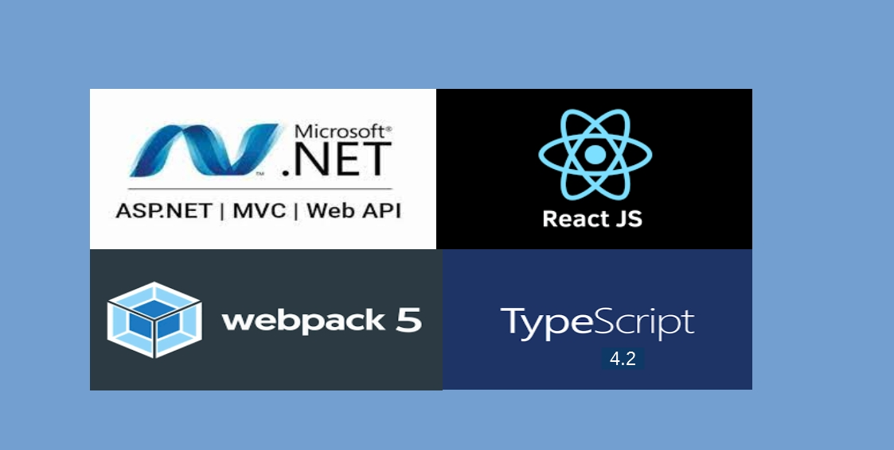

Template for ASP.NET MVC (.Net Framework 4.x.x) with React 17 with Typescript & Webpack 5.

## This is the follow-up post of this [blog]("https://kunwar.dk/posts/asp-dot-net-mvc-react-js-template/") and [blog]("https://kunwar.dk/posts/updated-asp-dot-net-mvc-react-15-webpack-5-template/")

> This template intends to replace V of ASP.NET MVC with React JS + Typescript. In other scenario, React application could be an independent application that consumes API. In that scenario, Create React App (CRA) would be an ideal choice due to its simplicity and hot reloading.

### What's new in this template?

1. Removed all non-necessary Views (only has Index.cshtml & views under Shared).
2. Removed Scripts folder.
3. Updated webpack.common.js.
4. React JS 17.
5. Webpack 5.
6. Typescript 4
7. ts-loader for webpack
8. Custom `ts` file so that _svg_ can be imported as `import logo from './icon/logo.svg'`

> _Visual Studio / TFS (Team Foundation Server) specific_: I personally prefer using Visual Studio Code for React JS development. However, Visual Studio might be needed to check-in the solution to the TFS (for example, using TFS 2013). If we use Visual Studio Code, then every time we build, we get output files under ** \dist ** folder. Visual Studio will not add any files created by other programs automatically. We have to manually add it. The easiest solution would be not to include files under \dist folder as they can always be generated. However, we need these files when we deploy. This project template has already implemented it so that TFS will ignore the files but will be included when deploying.

```
  </Content>
    <Content Visible="false" Include="wwwroot\dist\**">
    </Content>
```

Read my answer about it in [Stack Overflow](https://stackoverflow.com/questions/57825600/automatic-include-files-in-folder-in-visual-studio-2019-project/59676355#59676355)

Template can be downloaded from [Github](https://github.com/rameshkunwar/ReactJSDotNetFramework_TypeScript)

> My old [post](https://kunwar.dk/posts/asp-dot-net-mvc-react-js-template/) describes in detail how I made this template (without Typescript, however, process would be similar with Typescript as well).

### Related posts

1. [ASP.NET MVC (.Net Framework) with React 17 and Webpack 5](https://kunwar.dk/posts/updated-asp-dot-net-mvc-react-15-webpack-5-template/)
2. [ASP.NET MVC (.Net Framework) with React 16 and Webpack 4](https://kunwar.dk/posts/asp-dot-net-mvc-react-js-template/)
